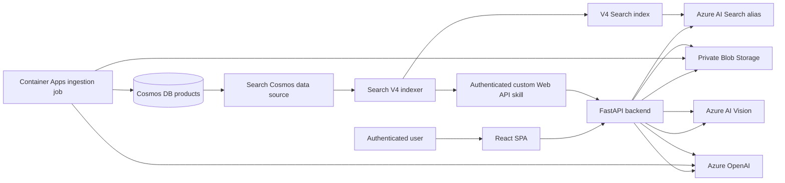

# TJX Retail Multimodal Search POC

This proof of concept provides authenticated retail product search across text and product images. It demonstrates keyword, vector, hybrid, semantic, image, and combined retrieval while keeping the product catalog in Azure Cosmos DB and all generated enrichment in Azure AI Search.

The reference environment currently indexes 31 products: 23 have private product images and 8 are metadata-only fixtures. Its stable Search alias `tjx-bvx-products-active` points to `tjx-bvx-products-enriched-v4`. A fresh environment initially creates this alias on V1 and must promote it explicitly after V4 indexing and validation.

## Project Documents

| Document | Purpose |
| --- | --- |
| [Detailed architecture](docs/architecture.md) | Explains the deployed components, data ownership, security boundaries, and request/indexing flows. |
| [Editable Draw.io architecture](docs/tjx-retail-search-architecture.drawio) | Visual architecture with Azure stencils, Microsoft Foundry model usage, and a plain-language flow guide. |
| [Monthly cost estimate](docs/cost-estimate.md) | Pricing assumptions and estimated monthly Azure cost in Markdown. |
| [Monthly cost estimate (HTML)](docs/cost-estimate.html) | Responsive, printable version of the monthly cost estimate. |
| [Production cost estimate](docs/prod-cost-estimate.md) | 15-million-item production assumptions, recurring run rate, initial enrichment cost, capacity checks, and sensitivities. |
| [Production cost estimate (HTML)](docs/prod-cost-estimate.html) | Responsive, printable version of the production cost estimate. |

## Architecture



## Component Responsibilities

| Component | Responsibility |
| --- | --- |
| React/Vite SPA | Signs users in with MSAL, collects text/images, selects a search mode, and renders results. |
| FastAPI backend | Validates Entra tokens, understands query intent, constructs safe filters, calls Search, vectorizes images, serves the custom enrichment skill, and proxies private images. |
| Cosmos DB | Source of truth for product records. Generated Search taxonomy and vectors are not written back. |
| Blob Storage | Stores private source product images. Browsers receive images only through the authenticated API proxy. |
| Ingestion job | Idempotently uploads 23 bundled images and upserts 31 source records into Cosmos. Its image analysis records only visible source facts. |
| Azure AI Search | Runs indexers and skillsets, stores derived searchable fields/vectors, applies filters, and ranks results. |
| Azure OpenAI | Produces structured query intent and index-time product enrichment. Search uses `text-embedding-3-small` for 1,536-dimensional text vectors. |
| Azure AI Vision | Creates 1,024-dimensional native image embeddings for indexed and query images. |
| Container Apps | Hosts the API/SPA and the one-shot ingestion job with a user-assigned managed identity. |
| Bicep and azd | Provision infrastructure, RBAC, private connectivity, application hosting, and repeatable deployment hooks. |

## Data Ownership

Cosmos DB owns source product data. The ingestion job writes stable product identifiers, catalog metadata, image references, and basic visible image facts to Cosmos. Stable IDs make repeated ingestion safe.

Azure AI Search owns all retrieval-specific derivatives:

- normalized product family and product type
- audiences, colors, materials, styles, closures, patterns, occasions, and attributes
- normalized brand and enrichment confidence
- generated `searchText`
- 1,536-dimensional `descriptionVector`
- 1,024-dimensional `imageVector`

Metadata-only records have no `imageVector`; this is expected and does not prevent text retrieval.

## Search Objects

All Search data-plane objects are declared in `config/search-objects.json` and applied by `scripts/manage_search_objects.py`. They are separate from ARM/Bicep because indexes, indexers, skillsets, data sources, and aliases are Search data-plane resources.

### Index Versions

| Version | Purpose |
| --- | --- |
| `tjx-bvx-products-baseline-v1` | Baseline fields and a name-derived text vector for comparison. |
| `tjx-bvx-products-enriched-v2` | Adds initial product enrichment fields and enriched text vectors. |
| `tjx-bvx-products-enriched-v3` | Adds normalized taxonomy, semantic configuration, audiences, and richer facets. |
| `tjx-bvx-products-enriched-v4` | Active multimodal schema. Adds native image vectors and indexes both image-bearing and metadata-only products. |

Application code queries `tjx-bvx-products-active`, not a versioned index name. This allows controlled index switching without redeploying the application. The alias is declared `createOnly` so applying the object graph does not silently reset an intentional switch.

### Data Sources, Skillsets, and Indexers

The V4 data source `tjx-bvx-cosmos-products-ds-v4` uses Search managed identity and Cosmos `_ts` high-water-mark change detection. It selects all changed products, including records without images.

The V4 indexer `tjx-bvx-products-enriched-indexer-v4` runs every 15 minutes in the private execution environment. For each changed Cosmos record it:

1. Calls `tjx-bvx-products-enriched-skillset-v4`.
2. Invokes `/api/skills/product-enrichment` using the Search service managed identity.
3. Validates that identity in the backend before processing the record.
4. Uses metadata and, when present, the private product image to generate normalized taxonomy and `searchText`.
5. Creates the native Vision `imageVector` for image-bearing products.
6. Uses the built-in Azure OpenAI embedding skill to create `descriptionVector` from `searchText`.
7. Maps only derived outputs into the V4 Search index.

The indexer does not modify Cosmos documents.

## Backend API

The backend exposes:

| Route | Access | Purpose |
| --- | --- | --- |
| `/healthz` | Anonymous | Container liveness. |
| `/readyz` | Anonymous | Confirms the active Search alias can answer a minimal query. |
| `/api/config` | Anonymous | Returns non-secret tenant, client, and API scope values needed to initialize MSAL at runtime. |
| `/api/search` | User token | Executes one of the six search modes. |
| `/api/images/{blob_name}` | User token | Streams a private product image after validating a single safe Blob name. |
| `/api/skills/product-enrichment` | Search identity token | Custom Web API skill used only by the Search indexer. |

Runtime configuration lets the same built frontend image work in different environments. Tokens are cached in browser session storage and private Blob URLs are never sent directly to the browser.

## Search Modes

| Mode | Retrieval behavior |
| --- | --- |
| Keyword | Lexical matching over searchable text. |
| Vector | Text-to-vector nearest-neighbor retrieval over `descriptionVector`. |
| Hybrid | Combines lexical and text-vector candidates. |
| Semantic | Hybrid retrieval with the `tjx-bvx-products-semantic-v3` semantic reranker. |
| Image | Infers a broad canonical product family, prefilters to that family, and ranks native `imageVector` similarity. |
| Combined | Uses the image for broad family/ranking context and the user's text for explicit constraints such as audience or color, then performs multimodal ranking. |

Image vectors and text vectors are in different embedding spaces and dimensions. They are sent as separate Search vector queries and must never be compared directly.

## Query Intent and Filters

Free-form text is converted to a typed `QueryIntent`. Pydantic and the model's JSON schema constrain product families to the canonical taxonomy before any value can become an OData filter. This prevents model vocabulary such as `sandals` from being used where the index expects the family `footwear`.

Filter construction follows these rules:

- Only a fixed allowlist of index fields can be used.
- Values are escaped before being inserted into OData expressions.
- Alternatives within a facet use `or`, for example black **or** brown.
- Different facets use `and`, for example footwear **and** men.
- Product-type filters are omitted for multi-family queries because type/family pairs are not correlated in a flat filter expression.
- Descriptive facets such as materials, styles, closures, patterns, and occasions remain in ranking text rather than becoming brittle exact filters.
- Image mode applies the image-inferred broad family before nearest-neighbor ranking to avoid unrelated visual neighbors.
- Combined mode takes broad family from the image and hard constraints from explicit text. The image is not allowed to invent restrictive audience/color filters.
- During index-version transitions, the backend retries with the older V3 field set, then the V2 field set, and finally without filters if an alias target does not support newer fields.
- This compatibility fallback adapts filters only. Image and combined modes require V4's `imageVector`; semantic and combined modes require an index containing the semantic configuration.
- Unfiltered semantic/combined results with reranker score below `2.5` are suppressed. An applied structured filter already provides a strong eligibility signal, so filtered results are not removed by that threshold.

Search synonym maps can improve lexical equivalence for stable domain vocabulary, such as controlled spelling or retailer terminology. They affect searchable text analysis; they do not normalize filter values, change vector embeddings, or replace the canonical intent schema. No synonym map is currently required by the active V4 flow.

## Identity and Network Security

- Users authenticate with a single-tenant Microsoft Entra application.
- The API validates signature, issuer, API audience, lifetime, and tenant for every bearer token. This POC does not separately enforce the delegated `scp` claim.
- The custom skill additionally requires the exact Azure AI Search managed-identity object ID.
- The app and ingestion job use one user-assigned managed identity for Azure dependencies and ACR image pulls.
- Search uses its managed identity to read Cosmos and call the authenticated custom skill.
- RBAC is scoped to the individual resources in `infra/modules/access.bicep`.
- Blob Storage and Cosmos DB are private and resolve through private endpoints from the Container Apps virtual network.
- Search reaches Cosmos through a Search shared private link. The apply script approves only the POC-owned connection.
- No storage, database, Search, OpenAI, or Vision keys are stored in application configuration.

## Repository Map

| Path | Contents |
| --- | --- |
| `app/api/` | FastAPI routes, contracts, authentication, settings, and Azure service adapters. |
| `app/frontend/` | React/Vite/MSAL client; build output is served by FastAPI. |
| `app/ingestion/` | Deterministic source catalog construction and the Container Apps ingestion command. |
| `app/source-images/` | Bundled POC product images. |
| `config/search-objects.json` | Versioned Search indexes, data sources, skillsets, indexers, and alias. |
| `infra/` | Subscription-scope Bicep orchestration and resource modules. |
| `scripts/` | Deployment, Search management, Entra setup, evaluation, switching, and validation tools. |
| `tests/unit/` | Unit tests for API contracts, filters, search execution, authentication, ingestion, and scripts. |
| `docs/` | Architecture detail, assumptions, plans, and demo runbooks. This README is the current operational overview. |

## Local Development

Prerequisites:

- Python 3.11-3.13
- Node.js and npm
- Azure CLI
- Azure Developer CLI (`azd`) for provisioning/deployment
- An authenticated Azure identity with access to the target resources

From PowerShell:

```powershell
python -m venv .venv
.\.venv\Scripts\python.exe -m pip install -e ".[dev]"
npm --prefix app\frontend install
npm --prefix app\frontend run build
.\.venv\Scripts\python.exe -m uvicorn app.api.main:app --reload
```

The API reads Azure endpoints and Entra identifiers from environment variables defined by `app/api/settings.py`. `DefaultAzureCredential` uses the developer's Azure CLI credential locally and the configured managed identity in Azure.

## Validation

Run the behavior and source checks before deployment:

```powershell
.\.venv\Scripts\ruff.exe check app scripts tests
.\.venv\Scripts\python.exe -m pytest -q
npm --prefix app\frontend run build
az bicep build --file infra\main.bicep
.\.venv\Scripts\python.exe scripts\validate_phase3.py
```

Search object operations use environment values exported by azd:

```powershell
azd env get-values | ForEach-Object {
    if ($_ -match '^([^=]+)="(.*)"$') { Set-Item -Path "Env:$($matches[1])" -Value $matches[2] }
}
.\.venv\Scripts\python.exe scripts\manage_search_objects.py plan
.\.venv\Scripts\python.exe scripts\manage_search_objects.py validate
```

`apply` changes live Search data-plane resources and also waits for/approves the POC Search-to-Cosmos private link:

```powershell
.\.venv\Scripts\python.exe scripts\manage_search_objects.py apply
```

`scripts/evaluate_search_variants.py` is the legacy text comparison for V1-V3 and does not evaluate V4 image vectors. Use unit/integration queries for V4 multimodal evaluation, then use `scripts/switch_search_variant.py` to move the stable alias.

## Deployment

Deployment is CI/CD-repeatable through azd and Bicep:

```powershell
azd auth login
azd env new <environment-name>
azd env set AZURE_SUBSCRIPTION_ID <subscription-id>
azd env set AZURE_RESOURCE_GROUP <resource-group-name>
azd env set AZURE_DEPLOYMENT_PRINCIPAL_ID <deploying-principal-object-id>
azd env set AZURE_TENANT_ID <tenant-id>
azd env set ENTRA_CLIENT_ID <application-client-id>
azd env set ENTRA_API_AUDIENCE api://<application-client-id>
azd up
```

The azd lifecycle is intentionally ordered:

1. `preprovision` registers required subscription features.
2. Bicep provisions identity, data services, private networking, RBAC, Container Apps, ACR, and observability.
3. `prepackage` validates the phase 3 configuration.
4. azd builds and deploys the web container.
5. `postdeploy` points the ingestion job at the same image, applies Search objects, confirms the protected skill route is live, and configures Entra redirect/API settings.
6. Start the ingestion job to seed Cosmos and Blob Storage.
7. Run or wait for the V4 indexer and verify that all 31 records completed. Eight missing-image-vector warnings are expected for metadata-only records.
8. Run multimodal relevance checks, then promote the alias explicitly:

```powershell
az containerapp job start --name $Env:AZURE_CONTAINER_JOB_NAME --resource-group $Env:AZURE_RESOURCE_GROUP
.\.venv\Scripts\python.exe scripts\switch_search_variant.py multimodal
```

`manage_search_objects.py apply` preserves an existing alias. In a fresh environment it creates the alias on baseline V1, so step 8 is required before image or combined mode can work.

The Vision resource is deployed to East US because the multimodal embedding API is not available in Central US. Other workload resources use the configured primary location.

## Further Reading

- `docs/architecture.md`: deeper architecture and security rationale
- `docs/cost-estimate.md`: shareable monthly POC cost estimate and scaling assumptions
- `docs/assumptions.md`: constraints and design assumptions
- `docs/demo-runbook.md`: demonstration sequence
- `docs/implementation-plan.md`: implementation history and phased plan
- `deployment-plan.md`: deployment planning detail
