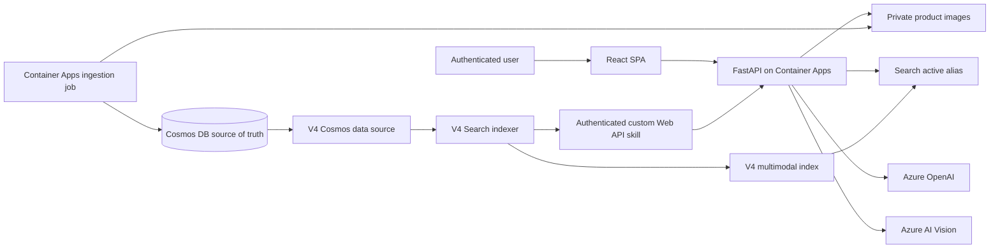
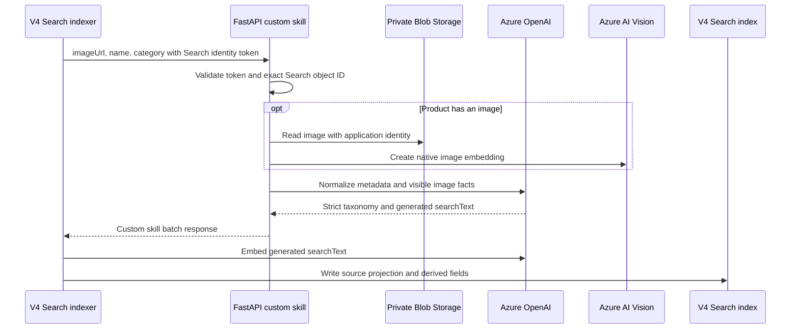
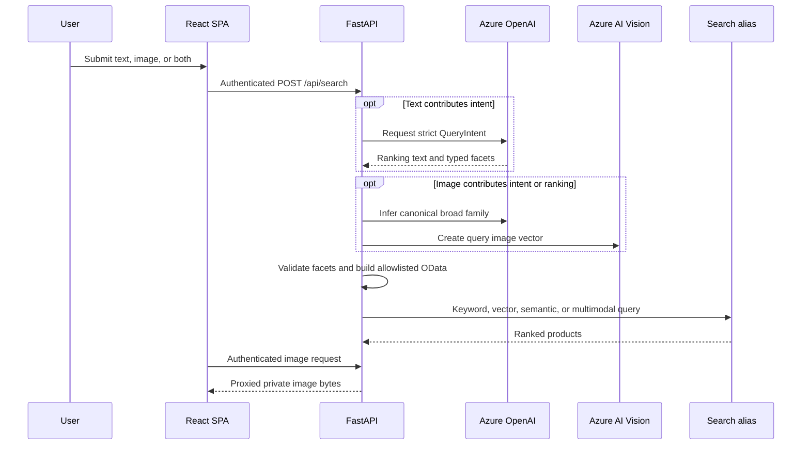

# Architecture

The root [README](../README.md) is the canonical developer and operations guide. This document records the main architectural boundaries and rationale for the deployed V4 solution.

## Current State

The reference environment is deployed primarily in Central US in `rg-tjx-retail-search-poc-greenfield-new`. Azure AI Vision is in East US because native multimodal embeddings are unavailable in Central US.

The application searches 31 synthetic products: 23 image-bearing records and 8 metadata-only records. Cosmos DB for NoSQL is the source of truth. Azure AI Search stores all normalized taxonomy, generated search text, and vectors. In the reference environment, the stable alias `tjx-bvx-products-active` points to `tjx-bvx-products-enriched-v4`; a fresh environment starts on V1 until V4 is indexed, evaluated, and explicitly promoted.

## Deployed Topology

The app and one-shot ingestion job run the same immutable container image with a user-assigned managed identity. The Search service uses its own identity to read Cosmos and call the custom skill. The backend checks the exact Search identity object ID at that route.

## Source and Derived Data

The ingestion job creates stable IDs, uploads private images, and upserts source records. Its model call records only visible product facts and does not infer brand, audience, price, or provenance.

The Search enrichment pipeline creates retrieval-specific fields without changing Cosmos:

- canonical product family and normalized product type
- audience, color, material, style, closure, pattern, occasion, brand, and attributes
- enrichment confidence and generated `searchText`
- 1,536-dimensional `descriptionVector` from `text-embedding-3-small`
- 1,024-dimensional native Vision `imageVector`

Metadata-only products deliberately have no `imageVector`. They remain available to all text-based search modes.

## Index-Time Enrichment

The V4 data source uses Cosmos `_ts` as a high-water mark and selects all changed records. The indexer runs every 15 minutes in Search's private execution environment. Search reaches Cosmos through an approved shared private link.

## Query-Time Retrieval

Keyword, vector, hybrid, and semantic modes retrieve from text. Image mode prefilters by the image-inferred canonical family and ranks native image-vector similarity. Combined mode uses the image for broad family/ranking context and applies only explicit text constraints as additional hard filters.

Filter alternatives inside one facet use `or`; separate facets use `and`. Product types are not hard-filtered when multiple families are requested because flat OData expressions cannot retain the intended family/type pairing. During alias transitions, the API adapts filters through V3, V2, and unfiltered compatibility fallbacks. That fallback does not adapt schemas: image/combined modes require V4, and semantic/combined modes require the semantic configuration. Unfiltered semantic candidates below reranker score `2.5` are suppressed; filtered candidates are retained because the filter already supplies a strong eligibility signal.

## Identity and Network Boundaries

- Users authenticate through a single-tenant Microsoft Entra application.
- The API validates token signature, issuer, API audience, lifetime, and tenant. The POC does not independently enforce the delegated `scp` claim.
- The custom skill accepts only the configured Search managed identity.
- The application identity accesses Search, Blob, Cosmos, Azure OpenAI, Vision, and ACR through resource-scoped RBAC.
- Blob Storage and Cosmos use private endpoints and private DNS in the Container Apps virtual network.
- Search uses a shared private link to Cosmos.
- Account keys, client secrets, public Blob access, and persistent SAS URLs are not used.

## Versioned Indexes

V1 is the baseline, V2 adds initial enrichment, V3 adds canonical taxonomy and semantic ranking, and V4 adds native image vectors plus metadata-only product coverage. Versioned indexes remain available for evaluation. The stable alias lets the application switch variants without a code or configuration deployment, but only V4 supports all six application modes.

Production readiness still requires human-labeled relevance judgments, load and failure tests, operational alerts, and customer security, privacy, Responsible AI, retention, and cost reviews.
