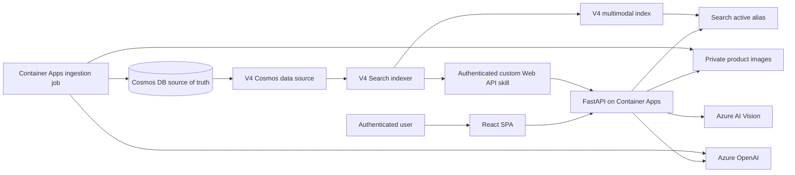
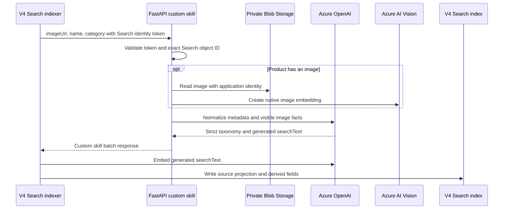
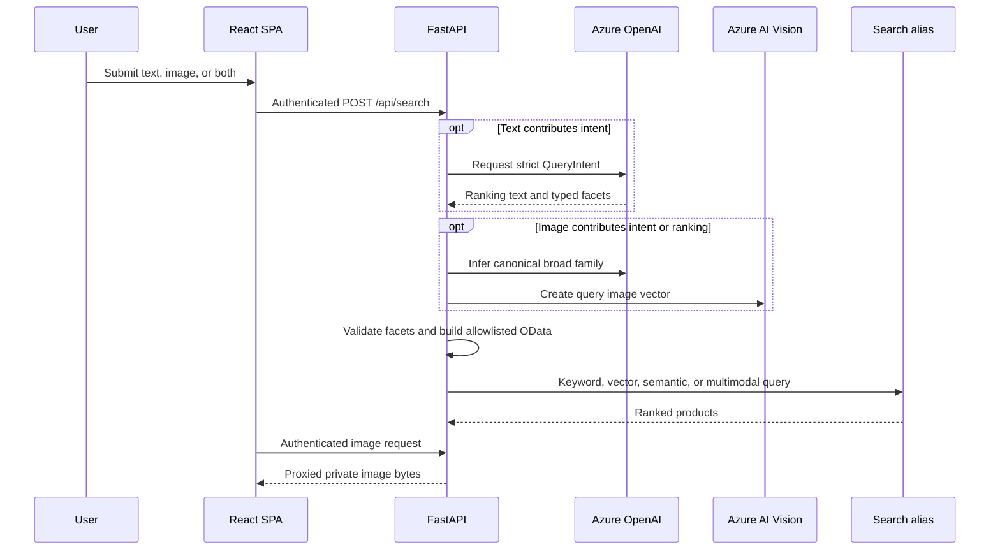

# Architecture

The root [README](../README.md) is the canonical developer and operations guide. This document records the main architectural boundaries and rationale for the deployed V4 solution.

## Current State

The reference environment is deployed primarily in Central US in `rg-tjx-retail-search-poc-greenfield-new`, in subscription `86131db2-44b0-4062-b0fd-97b49a1cbacf`. Azure AI Vision is in East US because native multimodal embeddings are unavailable in Central US.

The application searches 31 synthetic products: 23 image-bearing records and 8 metadata-only records. Cosmos DB for NoSQL is the source of truth. Azure AI Search stores all normalized taxonomy, generated search text, and vectors. In the reference environment, the stable alias `tjx-bvx-products-active` points to `tjx-bvx-products-enriched-v4`; a fresh environment starts on V1 until V4 is indexed, evaluated, and explicitly promoted.

The repository is hosted on GitHub and has no CI/CD pipeline. Builds and deployments are run locally with `azd` and `az acr build`. Establishing a pipeline with its own workload identity is an open production item.

## Deployed Topology

```mermaid
flowchart LR
    User[Authenticated user] --> UI[React SPA]
    UI --> API[FastAPI on Container Apps]
    API --> Alias[Search active alias]
    API --> Blob[Private product images]
    API --> AOAI[Azure OpenAI]
    API --> Vision[Azure AI Vision]

    Job[Container Apps ingestion job] --> Blob
    Job --> Cosmos[(Cosmos DB source of truth)]
    Job --> AOAI
    Cosmos --> DS[V4 Cosmos data source]
    DS --> Indexer[V4 Search indexer]
    Indexer --> Skill[Authenticated custom Web API skill]
    Skill --> API
    Indexer --> V4[V4 multimodal index]
    V4 --> Alias
```

The app and one-shot ingestion job run the same immutable container image with a user-assigned managed identity. The Search service uses its own identity to read Cosmos and call the custom skill. The backend checks the exact Search identity object ID at that route.

## Source and Derived Data

The ingestion job creates stable IDs, uploads private images, and upserts source records. Its model call records only visible product facts and does not infer brand, audience, price, or provenance.

The Search enrichment pipeline creates retrieval-specific fields without changing Cosmos:

- canonical product family and normalized product type
- audience, color, material, style, closure, pattern, occasion, brand, and attributes
- enrichment confidence and generated `searchText`
- 1,536-dimensional `descriptionVector` from `text-embedding-3-small`
- 1,024-dimensional native Vision `imageVector`

Metadata-only products deliberately have no `imageVector`. They remain available to all text-based search modes.

### Filterable Taxonomy Contract

Indexed values and query intent must share one vocabulary, because a filter compares them literally. Two rules keep both sides aligned:

- `productFamily` is constrained to the canonical set (`accessories`, `apparel`, `bag`, `footwear`, `general merchandise`, `wallet`) on both sides. The enrichment JSON schema pins it to that enum, and index-side validation maps known variants such as `handbags` to `bag` before a value can be stored. Query intent stays strict and rejects anything outside the set, because its own schema enum already guarantees a canonical value.
- `primaryColors` records only the dominant color of the product body, most dominant first, and at most two for genuinely two-tone products. Hardware, zips, buckles, clasps, logos, trim, stitching, linings, soles, and contrasting straps are excluded and belong in `attributes` or `searchText`. Without this rule a red handbag with a black handle answers a black-only query.

`productType` is deliberately not constrained. Enrichment stores specific variants such as `crossbody bag` or `satchel handbag`, which rarely equal a shopper's word, so retrieval treats it as the least reliable hard filter.

## Index-Time Enrichment

```mermaid
sequenceDiagram
    participant I as V4 Search indexer
    participant A as FastAPI custom skill
    participant B as Private Blob Storage
    participant O as Azure OpenAI
    participant V as Azure AI Vision
    participant S as V4 Search index
    I->>A: imageUrl, name, category with Search identity token
    A->>A: Validate token and exact Search object ID
    opt Product has an image
        A->>B: Read image with application identity
        A->>V: Create native image embedding
    end
    A->>O: Normalize metadata and visible image facts
    O-->>A: Strict taxonomy and generated searchText
    A-->>I: Custom skill batch response
    I->>O: Embed generated searchText
    I->>S: Write source projection and derived fields
```

The V4 data source uses Cosmos `_ts` as a high-water mark and selects all changed records. The indexer runs every 15 minutes in Search's private execution environment. Search reaches Cosmos through an approved shared private link.

## Query-Time Retrieval

```mermaid
sequenceDiagram
    participant U as User
    participant UI as React SPA
    participant A as FastAPI
    participant O as Azure OpenAI
    participant V as Azure AI Vision
    participant S as Search alias
    U->>UI: Submit text, image, or both
    UI->>A: Authenticated POST /api/search
    opt Text contributes intent
        A->>O: Request strict QueryIntent
        O-->>A: Ranking text and typed facets
    end
    opt Image contributes intent or ranking
        A->>O: Infer canonical broad family
        A->>V: Create query image vector
    end
    A->>A: Validate facets and build allowlisted OData
    A->>S: Keyword, vector, semantic, or multimodal query
    S-->>A: Ranked products
    UI->>A: Authenticated image request
    A-->>UI: Proxied private image bytes
```

Keyword, vector, hybrid, and semantic modes retrieve from text. Image mode prefilters by the image-inferred canonical family and ranks native image-vector similarity. Combined mode uses the image for broad family/ranking context and applies only explicit text constraints as additional hard filters.

Filter alternatives inside one facet use `or`; separate facets use `and`. Product types are not hard-filtered when multiple families are requested because flat OData expressions cannot retain the intended family/type pairing. Unfiltered semantic candidates below reranker score `2.5` are suppressed; filtered candidates are retained because the filter already supplies a strong eligibility signal.

Retrieval uses two separate retry chains, because a filter can fail for two unrelated reasons:

- **Relaxation** handles a filter that is valid but matches no documents. It may drop only the model's inferred `productType`. The family, color, and audience a shopper stated are never discarded, so a query for white bags returns nothing rather than white sandals when no white bag exists.
- **Compatibility** is entered only when the index *rejects* a field with HTTP 400, which happens when the stable alias points at an older index schema. It may drop any field, including `productFamily`, because the goal is to find a filter the target index accepts. It adapts filters only: image and combined modes still require V4, and semantic and combined modes require the semantic configuration.

## Identity and Network Boundaries

- Users authenticate through a single-tenant Microsoft Entra application.
- The API validates token signature, issuer, API audience, lifetime, and tenant. The POC does not independently enforce the delegated `scp` claim.
- The custom skill accepts only the configured Search managed identity.
- The application identity accesses Search, Blob, Cosmos, Azure OpenAI, Vision, and ACR through resource-scoped RBAC.
- Blob Storage and Cosmos use private endpoints and private DNS in the Container Apps virtual network.
- Search uses a shared private link to Cosmos.
- Account keys, client secrets, public Blob access, and persistent SAS URLs are not used.

## Versioned Indexes

V1 is the baseline, V2 adds initial enrichment, V3 adds canonical taxonomy and semantic ranking, and V4 adds native image vectors plus metadata-only product coverage. Versioned indexes remain available for evaluation. The stable alias lets the application switch variants without a code or configuration deployment, but only V4 supports all six application modes.

Production readiness still requires human-labeled relevance judgments, load and failure tests, operational alerts, and customer security, privacy, Responsible AI, retention, and cost reviews.
